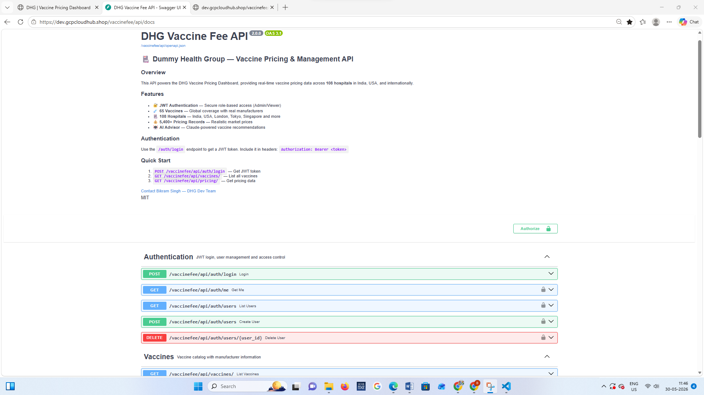
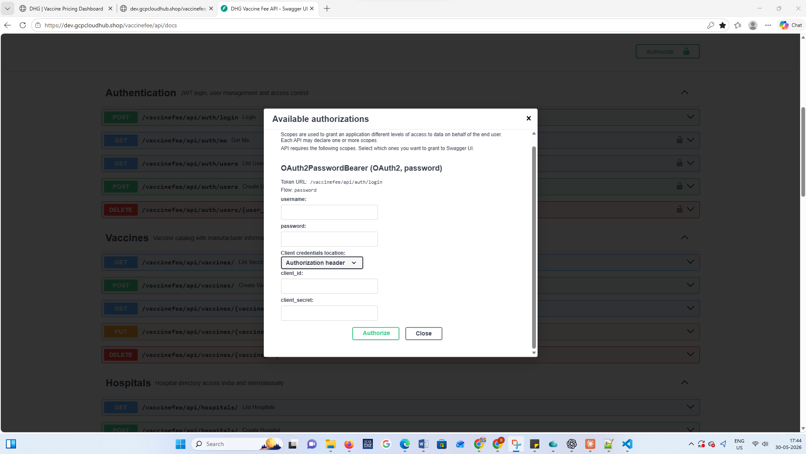
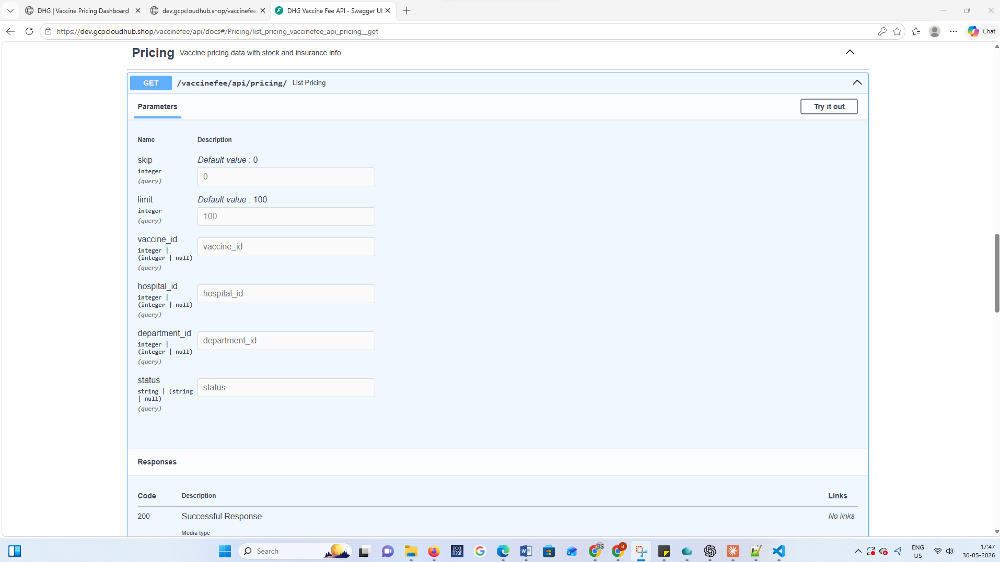
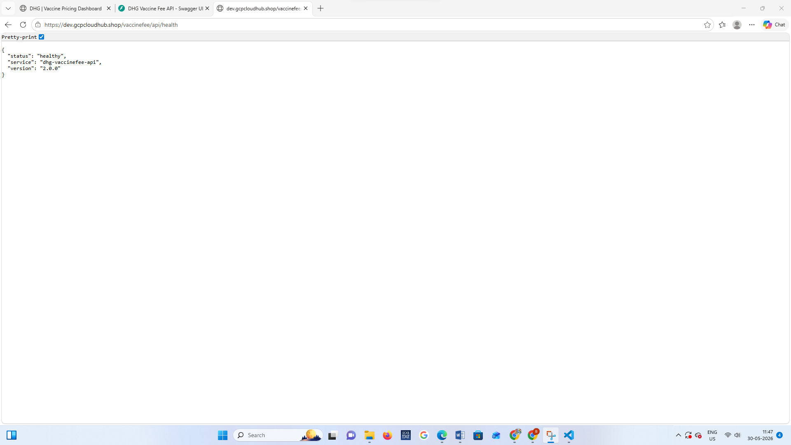
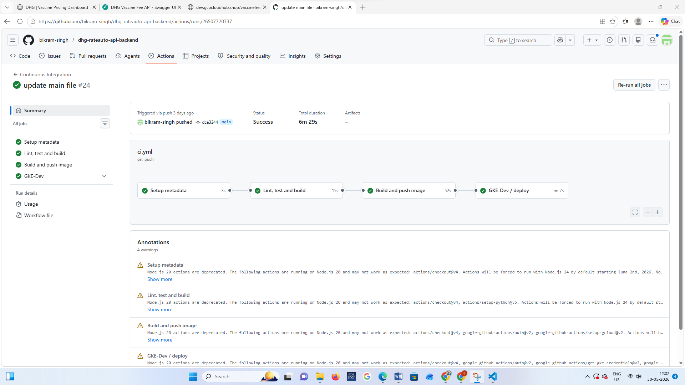
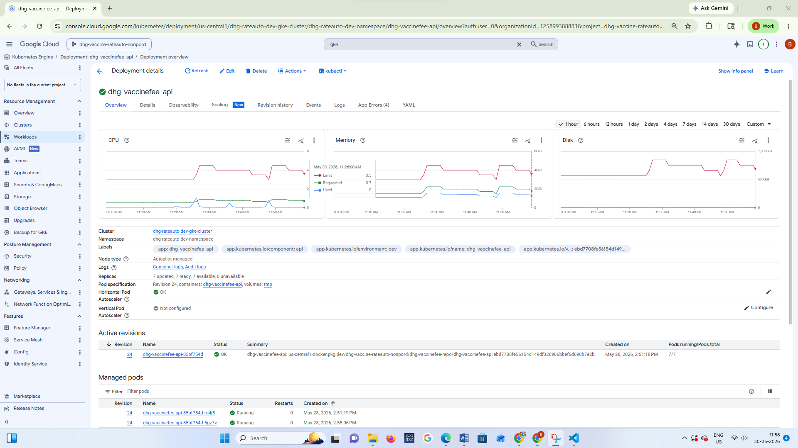

<div align="center">


# ⚡ DHG Vaccine Fee Pricing API

### Enterprise Healthcare Backend · FastAPI · Async Python · Claude AI
### `dhg-rateauto-api-backend` — Dummy Health Group

<br/>

[](https://python.org)
[](https://fastapi.tiangolo.com)
[](https://cloud.google.com/sql)
[](https://sqlalchemy.org)
[](https://docker.com)
[](https://cloud.google.com/kubernetes-engine)
[](https://anthropic.com)
[](https://jwt.io)
[](https://cloud.google.com/vpc/docs/private-service-connect)
[](https://cloud.google.com/iam/docs/workload-identity-federation)
[](https://github.com/c4urself/bump2version)

<br/>

> *A production-grade async REST API backend - 25+ endpoints across 6 routers, JWT authentication with RBAC, bcrypt password hashing, Claude AI integration, async SQLAlchemy with asyncpg, and full Swagger UI. Deployed on GKE Autopilot with zero-downtime rolling updates.*

<br/>

**❤️ Health Check:** [`https://dev.gcpcloudhub.shop/vaccinefee/api/health`](https://dev.gcpcloudhub.shop/vaccinefee/api/health)

**📖 Swagger UI:** [`https://dev.gcpcloudhub.shop/vaccinefee/api/docs`](https://dev.gcpcloudhub.shop/vaccinefee/api/docs)

</div>

---

## 📋 Table of Contents

- [Overview](#-overview)
- [Platform at a Glance](#-platform-at-a-glance)
- [UI Gallery](#-ui-gallery)
- [Tech Stack](#-tech-stack)
- [API Endpoints](#-api-endpoints)
- [Project Structure](#-project-structure)
- [Database Schema](#-database-schema)
- [Authentication & RBAC](#-authentication--rbac)
- [AI Advisor Endpoint](#-ai-advisor-endpoint)
- [Async Architecture](#-async-architecture)
- [Local Development](#-local-development)
- [Docker](#-docker)
- [Kubernetes](#-kubernetes)
- [CI/CD Pipeline](#-cicd-pipeline)
- [Flake8 & Code Quality](#-flake8--code-quality)
- [Environment Variables](#-environment-variables)
- [Security](#-security)
- [Automated Versioning](#-automated-versioning)
- [Related Repositories](#-related-repositories)

---

## 🌐 Overview

The **DHG Vaccine Fee Pricing API** is the backend engine powering the entire DHG healthcare platform. It is a fully **async FastAPI application** written in Python 3.12 — serving vaccine pricing data, hospital information, user authentication, and AI-powered consultation across 25+ REST endpoints.

The API connects to a **Cloud SQL PostgreSQL** instance via **Private Service Connect (PSC)** — the database has no public IP and is only reachable from within the VPC. It is containerised with Docker (multi-stage build), deployed on **GKE Autopilot**, and served at `/vaccinefee/api` via the GKE Gateway API.

### 🩺 What This API Powers

| Feature | Endpoint Group |
|---|---|
| Vaccine pricing across ~150 hospitals | `/pricing/` |
| Hospital directory (India, USA, Europe, Asia) | `/hospitals/` |
| Vaccine catalogue (40 real vaccines) | `/vaccines/` |
| Medical department management | `/departments/` |
| JWT login + token validation | `/auth/` |
| Claude AI vaccine advisor | `/ai/chat` |

---

## 📊 Platform at a Glance

| Metric | Value |
|---|---|
| ⚡ **Framework** | FastAPI 0.115.0 — async ASGI |
| 🐍 **Python** | 3.12 |
| 🗄️ **Database** | PostgreSQL (Cloud SQL) via PSC at `10.10.0.3:5432` |
| 📡 **ORM** | SQLAlchemy 2.0 async + asyncpg driver |
| 🔐 **Auth** | JWT HS256 — 8-hour expiry + bcrypt password hashing |
| 🤖 **AI** | Claude Sonnet (`claude-sonnet-4-20250514`) |
| 🏥 **Hospitals** | 108 real hospitals (India, USA, London, Tokyo, Singapore and more) |
| 💉 **Vaccines** | 65 vaccines — global coverage with real manufacturers |
| 💰 **Pricing Records** | 5,400+ records — realistic market prices |
| 🌍 **Countries** | 15+ countries |
| 📖 **API Docs** | Swagger UI v2.0.0 (`OAS 3.1`) at `/vaccinefee/api/docs` |
| 🔄 **Deploy** | Zero-downtime rolling update on GKE |
| 📦 **Docker** | Multi-stage — `python:3.12-slim` → production image |
| 🚢 **Port** | 8080 (uvicorn) |

---

## 🖼️ UI Gallery

> 📌 **Note:** All images are stored in `docs/gallery/`. Add your screenshots there to display them here.

### 📖 Swagger UI — Interactive API Docs


---

### 🔐 Auth Endpoints


---

### 💰 Pricing Endpoints


---

### ❤️ API Health Check


---

### 🔄 CI/CD Pipeline — GitHub Actions


---

### ☸️ GKE Workload — Deployment


---

## 🛠️ Tech Stack

### 🐍 Backend Core

| Technology | Version | Purpose |
|---|---|---|
| 🐍 **Python** | 3.12 | Primary language |
| ⚡ **FastAPI** | 0.115.0 | Async ASGI web framework |
| 🦄 **Uvicorn** | 0.30.6 | ASGI server with standard extras |
| 🗄️ **SQLAlchemy** | 2.0.35 (asyncio) | Async ORM |
| 🔌 **asyncpg** | 0.29.0 | Async PostgreSQL driver |
| ✅ **Pydantic** | 2.9.2 | Request/response validation |
| 🔐 **python-jose** | 3.3.0 | JWT token creation and validation |
| 🔒 **bcrypt** | 4.0.1 | Password hashing (direct — not passlib) |
| 🌐 **httpx** | 0.27.2 | Async HTTP client for Anthropic API |
| 📦 **python-multipart** | 0.0.12 | Form data parsing |

### 🚀 Infrastructure & Deployment

| Technology | Version | Purpose |
|---|---|---|
| 🐳 **Docker** | Multi-stage | `python:3.12-slim` builder → runtime image |
| ☸️ **GKE Autopilot** | Latest stable | Production Kubernetes deployment |
| 📦 **GAR** | — | Google Artifact Registry — Docker image storage |
| 🔄 **GitHub Actions** | — | CI/CD: lint → test → push → deploy |
| 🔐 **WIF** | — | Workload Identity Federation — no JSON keys |
| 🐘 **Cloud SQL** | PostgreSQL | Managed database via PSC (private IP) |

### 🔌 External Integrations

| Technology | Purpose |
|---|---|
| 🤖 **Anthropic Claude API** | AI Vaccine Advisor — `claude-sonnet-4-20250514` |
| 🔐 **K8s Secrets** | `dhg-vaccinefee-db-secret`, `dhg-vaccinefee-anthropic-api-secret`, `dhg-vaccinefee-jwt-secret` |

---

## 📡 API Endpoints

### ❤️ Health Router - `/vaccinefee/api`

| Method | Endpoint | Auth | Description |
|---|---|---|---|
| `GET` | `/health` | ❌ Public | Health check — returns `{"status":"healthy","version":"2.0.0"}` |

---

### 🔐 Auth Router - `/vaccinefee/api/auth`

| Method | Endpoint | Auth | Description |
|---|---|---|---|
| `POST` | `/auth/login` | ❌ Public | Login — returns JWT token |
| `GET` | `/auth/me` | ✅ JWT | Get current user info |
| `GET` | `/auth/users` | ✅ Admin | List all users |
| `POST` | `/auth/users` | ✅ Admin | Create new user |
| `DELETE` | `/auth/users/{id}` | ✅ Admin | Delete user |

---

### 🏥 Hospitals Router - `/vaccinefee/api/hospitals`

| Method | Endpoint | Auth | Description |
|---|---|---|---|
| `GET` | `/hospitals/` | ❌ Public | List all hospitals (paginated) |
| `GET` | `/hospitals/{id}` | ❌ Public | Get single hospital by ID |
| `POST` | `/hospitals/` | ✅ Admin | Create hospital |
| `PUT` | `/hospitals/{id}` | ✅ Admin | Update hospital |
| `DELETE` | `/hospitals/{id}` | ✅ Admin | Delete hospital |

---

### 💉 Vaccines Router - `/vaccinefee/api/vaccines`

| Method | Endpoint | Auth | Description |
|---|---|---|---|
| `GET` | `/vaccines/` | ❌ Public | List all vaccines (paginated) |
| `GET` | `/vaccines/{id}` | ❌ Public | Get single vaccine by ID |
| `POST` | `/vaccines/` | ✅ Admin | Create vaccine |
| `PUT` | `/vaccines/{id}` | ✅ Admin | Update vaccine |
| `DELETE` | `/vaccines/{id}` | ✅ Admin | Delete vaccine |

---

### 🏢 Departments Router - `/vaccinefee/api/departments`

| Method | Endpoint | Auth | Description |
|---|---|---|---|
| `GET` | `/departments/` | ❌ Public | List all departments |
| `GET` | `/departments/{id}` | ❌ Public | Get single department |
| `POST` | `/departments/` | ✅ Admin | Create department |
| `PUT` | `/departments/{id}` | ✅ Admin | Update department |
| `DELETE` | `/departments/{id}` | ✅ Admin | Delete department |

---

### 💰 Pricing Router - `/vaccinefee/api/pricing`

| Method | Endpoint | Auth | Description |
|---|---|---|---|
| `GET` | `/pricing/` | ✅ JWT | List pricing records (paginated — limit/skip) |
| `GET` | `/pricing/{id}` | ✅ JWT | Get single pricing record |
| `POST` | `/pricing/` | ✅ Admin | Create pricing record |
| `PUT` | `/pricing/{id}` | ✅ Admin | Update pricing record |
| `DELETE` | `/pricing/{id}` | ✅ Admin | Delete pricing record |

---

### 🤖 AI Router - `/vaccinefee/api/ai`

| Method | Endpoint | Auth | Description |
|---|---|---|---|
| `POST` | `/ai/chat` | ✅ JWT | Send message to Claude Sonnet — returns AI response |

---

## 📁 Project Structure

```
dhg-rateauto-api-backend/
│
├── 📁 .github/
│   └── 📁 workflows/
│       ├── 📄 ci.yml              # Main: lint → test → Docker push → GKE deploy
│       └── 📄 gke-deploy.yml     # Reusable deploy workflow (used by ci.yml)
│
├── 📁 Docker/
│   └── 📄 Dockerfile             # Multi-stage: python:3.12-slim → production image
│
├── 📁 k8s/
│   ├── 📄 deployment.yaml        # K8s Deployment — 1 replica, rolling update
│   ├── 📄 service.yaml           # ClusterIP Service — port 8080
│   ├── 📄 hpa.yaml               # Horizontal Pod Autoscaler
│   └── 📄 serviceaccount.yaml    # K8s ServiceAccount for Workload Identity
│
├── 📁 docs/
│   └── 📁 gallery/               # API gallery images (Swagger, pipeline screenshots)
│       ├── swagger-ui.png
│       ├── backend-ci-cd-pipeline.png
│       └── ...
│
├── 📁 dhg-vaccinefee-api/        # FastAPI application root
│   │
│   ├── 📄 main.py                # ⭐ FastAPI app — CORS, lifespan, router registration, Swagger v2.0.0
│   ├── 📄 database.py            # Async SQLAlchemy engine + session factory
│   │
│   ├── 📁 models/                # SQLAlchemy ORM models
│   │   ├── 📄 hospital.py        # Hospital table
│   │   ├── 📄 vaccine.py         # Vaccine table
│   │   ├── 📄 department.py      # Department table
│   │   ├── 📄 pricing.py         # Pricing table (junction — vaccine × hospital × dept)
│   │   └── 📄 user.py            # Users table with bcrypt password hash
│   │
│   └── 📁 routers/               # FastAPI route handlers
│       ├── 📄 auth.py            # JWT login, /me, user CRUD
│       ├── 📄 hospitals.py       # Hospital CRUD endpoints
│       ├── 📄 vaccines.py        # Vaccine CRUD endpoints
│       ├── 📄 departments.py     # Department CRUD endpoints
│       ├── 📄 pricing.py         # Pricing CRUD + paginated list
│       └── 📄 ai_advisor.py      # Claude Sonnet chat proxy
│
├── 📁 tests/                     # pytest test suite
│   └── 📄 test_*.py              # API endpoint tests
│
├── 📄 requirements.txt           # Python dependencies (pinned versions)
├── 📄 .bumpversion.cfg           # bump2version config — tracks VERSION file
├── 📄 VERSION                    # Plain text current version (e.g. 0.0.1)
└── 📄 README.md                  # This file
```

---

## 🗄️ Database Schema

Five tables powering the entire platform — connected via foreign keys:

```sql
-- Hospitals (~150 rows)
CREATE TABLE hospitals (
  id       SERIAL PRIMARY KEY,
  name     VARCHAR(200) NOT NULL,
  location VARCHAR(200),     -- "New Delhi, India" / "New York, USA"
  address  VARCHAR(500)      -- Full street address
);

-- Vaccines (40 rows — real manufacturers)
CREATE TABLE vaccines (
  id           SERIAL PRIMARY KEY,
  name         VARCHAR(200) NOT NULL,
  manufacturer VARCHAR(200),  -- Pfizer, GSK, Serum Institute, Bharat Biotech...
  description  TEXT
);

-- Departments (13 rows)
CREATE TABLE departments (
  id          SERIAL PRIMARY KEY,
  name        VARCHAR(100) NOT NULL,
  description TEXT
);

-- Pricing (5,000+ rows — core data)
CREATE TABLE pricing (
  id                SERIAL PRIMARY KEY,
  vaccine_id        INTEGER REFERENCES vaccines(id),
  hospital_id       INTEGER REFERENCES hospitals(id),
  department_id     INTEGER REFERENCES departments(id),
  price             NUMERIC(10,2),
  status            VARCHAR(50),   -- "Available" / "Low Stock" / "Out of Stock"
  insurance_covered VARCHAR(10),   -- "Yes" / "No" / "Vco"
  stock_quantity    INTEGER
);

-- Users (2 rows)
CREATE TABLE users (
  id            SERIAL PRIMARY KEY,
  username      VARCHAR(50) UNIQUE NOT NULL,
  password_hash VARCHAR(200) NOT NULL,  -- bcrypt hash (never plain text)
  full_name     VARCHAR(100),
  role          VARCHAR(20) DEFAULT 'Viewer',  -- "Admin" or "Viewer"
  is_active     BOOLEAN DEFAULT TRUE,
  created_at    TIMESTAMP DEFAULT NOW()
);
```

### Default Users

| Role | Username | Password | Access |
|---|---|---|---|
| 👑 **Admin** | `bikram` | `Admin@123` | Full CRUD on all endpoints |
| 👁️ **Viewer** | `viewer` | `View@123` | Read-only — write endpoints return 403 |

---

## 🔐 Authentication & RBAC

### JWT Login Flow

```
POST /vaccinefee/api/auth/login
  Body: { "username": "bikram", "password": "Admin@123" }
         │
         ▼
FastAPI auth router:
  1. Query users table by username
  2. bcrypt.checkpw(password, stored_hash)
  3. If valid → create JWT:
       payload = { "sub": username, "role": "Admin", "exp": now + 8h }
       token = jose.jwt.encode(payload, JWT_SECRET_KEY, "HS256")
         │
         ▼
  Returns: { "access_token": "eyJ...", "token_type": "bearer" }
         │
         ▼
Every protected endpoint:
  Authorization: Bearer eyJ...
         │
         ▼
  Dependency: get_current_user()
    → decode JWT → verify expiry → return user object
```

### RBAC Implementation

```python
# routers/auth.py

def require_admin(current_user: User = Depends(get_current_user)):
    if current_user.role != "Admin":
        raise HTTPException(status_code=403, detail="Admin access required")
    return current_user

# Usage in any router:
@router.post("/hospitals/")
async def create_hospital(
    data: HospitalCreate,
    db: AsyncSession = Depends(get_db),
    _: User = Depends(require_admin)   # ← Admin only
):
    ...
```

### Why bcrypt directly (not passlib)?

```python
# ✅ Direct bcrypt — compatible with bcrypt 4.0.1
import bcrypt
hashed = bcrypt.hashpw(password.encode("utf-8"), bcrypt.gensalt())
valid  = bcrypt.checkpw(password.encode("utf-8"), stored_hash)

# ❌ passlib — incompatible with bcrypt >= 4.0.0
# from passlib.context import CryptContext  ← breaks with bcrypt 5.x
```

`bcrypt` is pinned to `4.0.1` in `requirements.txt` — this was a specific compatibility fix during development.

---

## 🤖 AI Advisor Endpoint

### Architecture

```
POST /vaccinefee/api/ai/chat
  Body: { "messages": [...conversation history...] }
         │
         ▼
ai_advisor.py router:
  1. Builds system prompt with live data:
     ┌─────────────────────────────────────────────────────┐
     │ "You are DHG's expert vaccine advisor.              │
     │  Available vaccines: Covishield (Serum Inst.)...    │
     │  Available hospitals: AIIMS Delhi, Apollo...        │
     │  Price data: from ₹250 to ₹12,000..."              │
     └─────────────────────────────────────────────────────┘
  2. Calls Anthropic API via httpx (async):
     POST https://api.anthropic.com/v1/messages
     model: claude-sonnet-4-20250514
     max_tokens: 1000
     api-key: from K8s Secret
         │
         ▼
  Returns: { "content": "AI response text..." }
         │
         ▼
React frontend renders in chat bubble + optional TTS
```

### Implementation

```python
# routers/ai_advisor.py

@router.post("/ai/chat")
async def chat(request: ChatRequest, db: AsyncSession = Depends(get_db)):
    # Build context from live DB data
    vaccines = await db.execute(select(Vaccine))
    system_prompt = build_system_prompt(vaccines.scalars().all())

    async with httpx.AsyncClient(timeout=30.0) as client:
        response = await client.post(
            "https://api.anthropic.com/v1/messages",
            headers={
                "x-api-key": os.getenv("ANTHROPIC_API_KEY"),
                "anthropic-version": "2023-06-01",
            },
            json={
                "model": "claude-sonnet-4-20250514",
                "max_tokens": 1000,
                "system": system_prompt,
                "messages": request.messages,
            }
        )
    return {"content": response.json()["content"][0]["text"]}
```

---

## ⚙️ Async Architecture

The entire API is **async end-to-end** — from HTTP request handling down to database queries:

```python
# database.py

from sqlalchemy.ext.asyncio import create_async_engine, AsyncSession

DATABASE_URL = (
    f"postgresql+asyncpg://{DB_USER}:{DB_PASSWORD}"
    f"@{DB_HOST}:{DB_PORT}/{DB_NAME}"
)

engine = create_async_engine(DATABASE_URL, echo=False)

async def get_db():
    async with AsyncSession(engine) as session:
        yield session
```

```python
# Example router — fully async
@router.get("/pricing/")
async def list_pricing(
    limit: int = 500,
    skip: int = 0,
    db: AsyncSession = Depends(get_db)
):
    result = await db.execute(
        select(Pricing).offset(skip).limit(limit)
    )
    return result.scalars().all()
```

**Why async?**
- Handles thousands of concurrent requests without blocking
- No thread pool required — single-threaded event loop
- Each DB query releases the event loop while waiting — other requests are served
- Critical for the `/pricing/` endpoint which serves 5,000+ records in batches

---

## 🖥️ Local Development

### Prerequisites

```bash
python --version   # Requires >= 3.12
pip --version      # Latest
```

### Quick Start

```bash
# 1. Clone the repository
git clone https://github.com/bikram-singh/dhg-rateauto-api-backend.git
cd dhg-rateauto-api-backend/dhg-vaccinefee-api

# 2. Create virtual environment
python -m venv venv
source venv/bin/activate      # Linux/Mac
venv\Scripts\activate         # Windows PowerShell

# 3. Install dependencies
pip install -r requirements.txt

# 4. Set environment variables
export DB_HOST=10.10.0.3
export DB_PORT=5432
export DB_NAME=dhg-vaccinefee-db
export DB_USER=dhg-vaccinefee-user
export DB_PASSWORD=your-password
export JWT_SECRET_KEY=your-secret-key
export ANTHROPIC_API_KEY=sk-ant-...

# 5. Start the API server (hot reload)
uvicorn app.main:app --reload --port 8000 --host 0.0.0.0
# → http://localhost:8000/vaccinefee/api
# → http://localhost:8000/vaccinefee/api/docs  (Swagger UI)

# 6. Run linter
pip install flake8
flake8 app/ --max-line-length=120

# 7. Run tests
pip install pytest pytest-asyncio httpx
pytest tests/ -v
```

### Python Scripts

| Command | Description |
|---|---|
| 🚀 **Start** | `uvicorn app.main:app --reload --port 8000` |
| 🔍 **Lint** | `flake8 app/ --max-line-length=120` |
| 🧪 **Test** | `pytest tests/ -v` |
| 🌱 **Seed DB** | `python seed_real_data_v2.py` |

---

## 🐳 Docker

### Multi-Stage Dockerfile

```dockerfile
# ── Stage 1: Install dependencies ──────────────────────────────
FROM python:3.12-slim AS builder

WORKDIR /app
COPY requirements.txt .
RUN pip install --no-cache-dir --user -r requirements.txt

# ── Stage 2: Production runtime ────────────────────────────────
FROM python:3.12-slim

WORKDIR /app

# Copy installed packages from builder
COPY --from=builder /root/.local /root/.local

# Copy application code
COPY dhg-vaccinefee-api/ .

ENV PATH=/root/.local/bin:$PATH
ENV PYTHONUNBUFFERED=1

EXPOSE 8080

CMD ["uvicorn", "app.main:app", \
     "--host", "0.0.0.0", \
     "--port", "8080", \
     "--workers", "1"]
```

**Why multi-stage?**
- Final image has **no pip, no build tools** — only the installed packages and app code
- Smaller image = faster pull times in GKE
- Reduced attack surface in production

### Build & Run Locally

```bash
# Build image
docker build \
  -f Docker/Dockerfile \
  -t dhg-vaccinefee-api:local \
  .

# Run container with env vars
docker run -p 8080:8080 \
  -e DB_HOST=10.10.0.3 \
  -e DB_PORT=5432 \
  -e DB_NAME=dhg-vaccinefee-db \
  -e DB_USER=dhg-vaccinefee-user \
  -e DB_PASSWORD=your-password \
  -e JWT_SECRET_KEY=your-secret \
  -e ANTHROPIC_API_KEY=sk-ant-... \
  dhg-vaccinefee-api:local

# Test Swagger UI
open http://localhost:8080/vaccinefee/api/docs
```

---

## ☸️ Kubernetes

### `k8s/deployment.yaml`

```yaml
apiVersion: apps/v1
kind: Deployment
metadata:
  name: dhg-vaccinefee-api
  namespace: dhg-rateauto-dev-namespace
spec:
  replicas: 1
  strategy:
    type: RollingUpdate
    rollingUpdate:
      maxSurge: 1
      maxUnavailable: 0    # Zero downtime

  template:
    spec:
      containers:
        - name: dhg-vaccinefee-api
          image: us-central1-docker.pkg.dev/dhg-vaccine-rateauto-nonpord/dhg-vaccinefee-repo/dhg-vaccinefee-api:latest
          ports:
            - containerPort: 8080
          env:
            - name: DB_HOST
              valueFrom:
                secretKeyRef:
                  name: dhg-vaccinefee-db-secret
                  key: DB_HOST
            - name: DB_PASSWORD
              valueFrom:
                secretKeyRef:
                  name: dhg-vaccinefee-db-secret
                  key: DB_PASSWORD
            - name: JWT_SECRET_KEY
              valueFrom:
                secretKeyRef:
                  name: dhg-vaccinefee-jwt-secret
                  key: JWT_SECRET_KEY
            - name: ANTHROPIC_API_KEY
              valueFrom:
                secretKeyRef:
                  name: dhg-vaccinefee-anthropic-api-secret
                  key: ANTHROPIC_API_KEY
```

### K8s Secrets Used

| Secret Name | Keys | Purpose |
|---|---|---|
| `dhg-vaccinefee-db-secret` | `DB_HOST`, `DB_PORT`, `DB_NAME`, `DB_USER`, `DB_PASSWORD` | PostgreSQL PSC connection |
| `dhg-vaccinefee-jwt-secret` | `JWT_SECRET_KEY` | JWT token signing |
| `dhg-vaccinefee-anthropic-api-secret` | `ANTHROPIC_API_KEY` | Claude AI access |

### All K8s Resources

| File | Kind | Purpose |
|---|---|---|
| `deployment.yaml` | `Deployment` | Pod spec, secrets injection, rolling update |
| `service.yaml` | `Service` | ClusterIP on port 8080 |
| `hpa.yaml` | `HorizontalPodAutoscaler` | Auto-scales on CPU/memory |
| `serviceaccount.yaml` | `ServiceAccount` | Workload Identity binding |

---

## ⚙️ CI/CD Pipeline

### Pipeline Flow (`.github/workflows/ci.yml`)

```
Push to main branch
        │
        ▼
┌──────────────────────────────────────────────────────────────┐
│  Job 1 — Setup                                                │
│  • Detect auto-commits → set ABORT=true if found            │
│  • Set SHOULD_DEPLOY=true for main branch push              │
└──────────────────────────────────┬───────────────────────────┘
                                   │
                                   ▼
┌──────────────────────────────────────────────────────────────┐
│  Job 2 — CI (Lint, Test)                                      │
│  • pip install -r requirements.txt                           │
│  • flake8 app/ --max-line-length=120   ← FAIL if violations  │
│  • pytest tests/ -v                   ← FAIL if tests fail   │
└──────────────────────────────────┬───────────────────────────┘
                                   │
                                   ▼
┌──────────────────────────────────────────────────────────────┐
│  Job 3 — Build & Push Image                                   │
│  • Authenticate GCP via WIF (no JSON keys!)                  │
│  • docker buildx build -f Docker/Dockerfile --push .        │
│  • pip install bump2version                                  │
│  • bump2version patch → 0.0.1 → 0.0.2                       │
│  • git push origin main --follow-tags                        │
└──────────────────────────────────┬───────────────────────────┘
                                   │
                                   ▼
┌──────────────────────────────────────────────────────────────┐
│  Job 4 — GKE-Dev Deploy                                       │
│  • kubectl set image deployment/dhg-vaccinefee-api \        │
│      dhg-vaccinefee-api=${IMAGE}:${SHA}                      │
│  • kubectl rollout status → zero-downtime rolling update     │
└──────────────────────────────────────────────────────────────┘
```

### WIF Authentication (No Stored Keys)

```yaml
- name: Authenticate to Google Cloud
  uses: google-github-actions/auth@v2
  with:
    workload_identity_provider: ${{ secrets.GCP_WIF_PROVIDER_NONPROD }}
    service_account: ${{ secrets.GCP_WIF_SERVICE_ACCOUNT_NONPROD }}
```

GitHub mints a short-lived OIDC token → Google validates → issues temporary GCP credentials that expire when the job ends.

---

## 📋 Flake8 & Code Quality

### Lint Command

```bash
flake8 app/ \
  --max-line-length=120 \
  --exclude=__pycache__ \
  --per-file-ignores="__init__.py:F401" \
  --extend-ignore=W292,F811
```

### Rule Explanations

| Flag | Rule | Reason |
|---|---|---|
| `--max-line-length=120` | Lines up to 120 chars | FastAPI router signatures can be verbose |
| `--exclude=__pycache__` | Skip compiled files | Not source code |
| `F401` in `__init__.py` | Unused imports OK | `__init__.py` often re-exports |
| `W292` | No newline at EOF | Handled by editor config |
| `F811` | Redefinition of name | FastAPI dependency injection patterns |

### Key Code Patterns

```python
# ✅ Async all the way — never block the event loop
@router.get("/hospitals/")
async def list_hospitals(db: AsyncSession = Depends(get_db)):
    result = await db.execute(select(Hospital))
    return result.scalars().all()

# ✅ bcrypt direct — not passlib
import bcrypt
hashed = bcrypt.hashpw(pwd.encode("utf-8"), bcrypt.gensalt())

# ✅ All secrets from environment — never hardcoded
JWT_SECRET_KEY = os.getenv("JWT_SECRET_KEY")
ANTHROPIC_API_KEY = os.getenv("ANTHROPIC_API_KEY")
```

---

## 🔧 Environment Variables

All environment variables are injected from **K8s Secrets** at runtime — never hardcoded in code or Docker images:

| Variable | Source | Description |
|---|---|---|
| `DB_HOST` | `dhg-vaccinefee-db-secret` | PostgreSQL host (PSC IP: `10.10.0.3`) |
| `DB_PORT` | `dhg-vaccinefee-db-secret` | PostgreSQL port (`5432`) |
| `DB_NAME` | `dhg-vaccinefee-db-secret` | Database name (`dhg-vaccinefee-db`) |
| `DB_USER` | `dhg-vaccinefee-db-secret` | Database user (`dhg-vaccinefee-user`) |
| `DB_PASSWORD` | `dhg-vaccinefee-db-secret` | Database password (bcrypt-independent) |
| `JWT_SECRET_KEY` | `dhg-vaccinefee-jwt-secret` | JWT signing key (HS256) |
| `ANTHROPIC_API_KEY` | `dhg-vaccinefee-anthropic-api-secret` | Claude API key |

---

## 🔒 Security

| Layer | Implementation |
|---|---|
| 🔐 **Auth** | JWT HS256 — 8-hour expiry, validated on every protected request |
| 👥 **RBAC** | Admin vs Viewer — enforced at router level via `Depends(require_admin)` |
| 🔒 **Password** | bcrypt with gensalt — never stored plain text |
| 🛡️ **No public DB** | PostgreSQL only reachable via PSC private IP `10.10.0.3` |
| 🔐 **No secrets in code** | All keys in K8s Secrets → env vars at runtime |
| 🌐 **CORS** | Configured in `main.py` — restrict origins in production |
| 🔒 **HTTPS** | All traffic via GKE Gateway — TLS 1.2+ enforced |
| 🔐 **WIF** | No JSON keys — OIDC tokens per CI run |
| 🐳 **Minimal image** | `python:3.12-slim` — no unnecessary packages |
| 🔑 **RBAC K8s** | ServiceAccount with least-privilege IAM roles |

---

## 🔖 Automated Versioning

This repo uses **bump2version** to automatically increment the version number on every successful deployment to GKE dev — no manual version management needed.

### How It Works

```
Push to main
      │
      ▼
ci.yml: lint → test → Docker push → GKE deploy
      │
      ▼ (inside build-and-push-image job, after Docker push)
bump2version patch
      │
      ├── Updates VERSION file     0.0.1 → 0.0.2
      ├── Creates git commit: [2026-05-30] GitHub Actions Build 0.0.1 → 0.0.2
      └── Creates git tag:    v0.0.2
      │
      ▼
git push origin main --follow-tags
(bot pushes commit + tag back to repo)
```

### Config Files

| File | Location | Purpose |
|---|---|---|
| 📄 `.bumpversion.cfg` | Repo root | Master config — version format, files to update, commit/tag message |
| 📄 `VERSION` | Repo root | Plain text current version — single source of truth |

### `.bumpversion.cfg`

```ini
[bumpversion]
current_version = 0.0.1
commit = True
tag = True
tag_name = v{new_version}
message = [{now:%Y-%m-%d}] GitHub Actions Build {current_version} → {new_version}

[bumpversion:file:VERSION]
search = {current_version}
replace = {new_version}
```

### Version Progression

| Command | Before | After | When Used |
|---|---|---|---|
| `bump2version patch` | `0.0.1` | `0.0.2` | Every push to main (automatic) |
| `bump2version minor` | `0.0.2` | `0.1.0` | New feature — run manually |
| `bump2version major` | `0.1.0` | `1.0.0` | Major release — run manually |

### What You See on GitHub After Each Push

```
Commits on main

● [2026-05-30] GitHub Actions Build 0.0.1 → 0.0.2    github-actions[bot]
● fix: your actual commit message                      bikram-singh
```

> ⚠️ **Guardrail built-in:** The `setup` job detects auto-commits (`[.*]` pattern in commit message) and sets `ABORT=true` — preventing an infinite loop where the bot's version bump triggers another pipeline run.

---

## 🔗 Related Repositories

| Repository | Role | Purpose |
|---|---|---|
| [`dhg-rateauto-api-backend`](https://github.com/bikram-singh/dhg-rateauto-api-backend) | **This repo** | FastAPI Python Backend |
| [`dhg-rateauto-ui-frontend`](https://github.com/bikram-singh/dhg-rateauto-ui-frontend) | App Layer | React 18 Frontend Dashboard |
| [`dhg-rateauto-tf-vpc`](https://github.com/bikram-singh/dhg-rateauto-tf-vpc) | Infrastructure | VPC, Subnet, NAT, Firewall |
| [`dhg-rateauto-tf-gke`](https://github.com/bikram-singh/dhg-rateauto-tf-gke) | Infrastructure | GKE Autopilot Cluster |
| [`dhg-rateauto-tf-gke-routing`](https://github.com/bikram-singh/dhg-rateauto-tf-gke-routing) | Infrastructure | Gateway API, HTTPS, SSL |
| [`dhg-rateauto-tf-postgres`](https://github.com/bikram-singh/dhg-rateauto-tf-postgres) | Infrastructure | Cloud SQL PostgreSQL + PSC |
| [`dhg-rateauto-tf-gcs-buckets`](https://github.com/bikram-singh/dhg-rateauto-tf-gcs-buckets) | Infrastructure | GCS Bucket Provisioning |

---

<div align="center">

**Maintained by Bikram Singh**

`dhg-vaccine-rateauto-nonpord` · `us-central1` · FastAPI + GKE Autopilot

<br/>

**❤️ Health Check:** [`https://dev.gcpcloudhub.shop/vaccinefee/api/health`](https://dev.gcpcloudhub.shop/vaccinefee/api/health)

**📖 Swagger UI:** [`https://dev.gcpcloudhub.shop/vaccinefee/api/docs`](https://dev.gcpcloudhub.shop/vaccinefee/api/docs)

</div>
